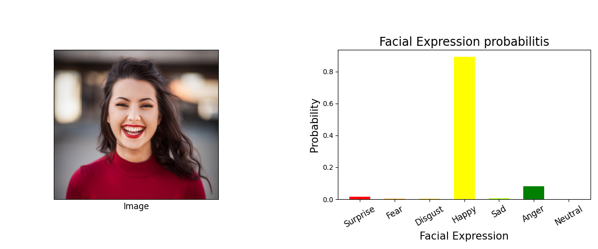
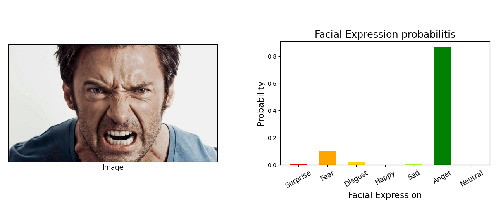
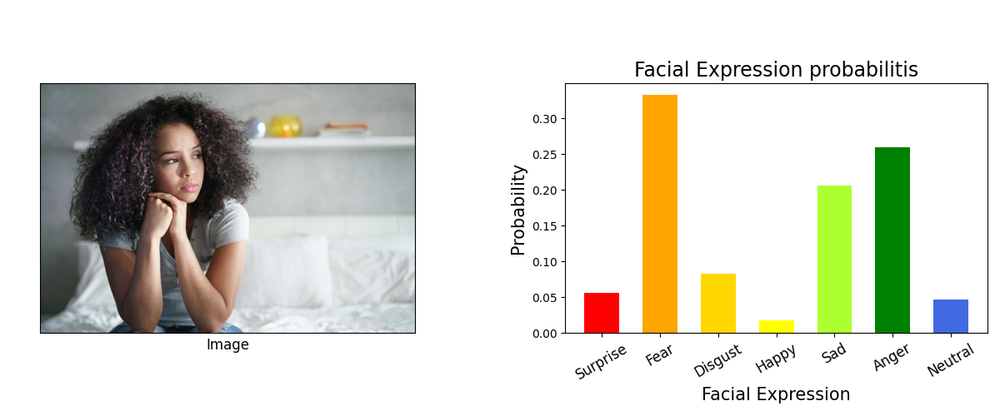

# FER with VGG & ResNet

## Use case
For training, use `python3 model.py --type <VGG or ResNet>`

For image testing, use `python3 main.py --image <Image Path> --type <VGG or ResNet09 or ResNet18>`

## Sample Output

  

  

  

